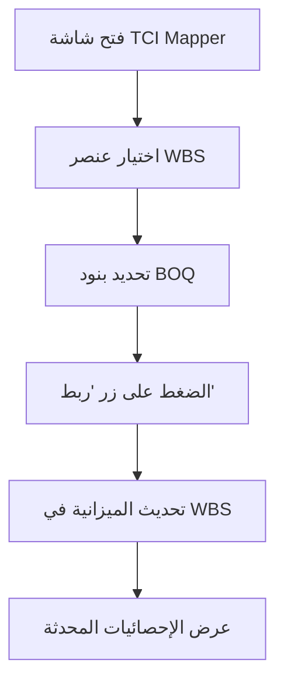
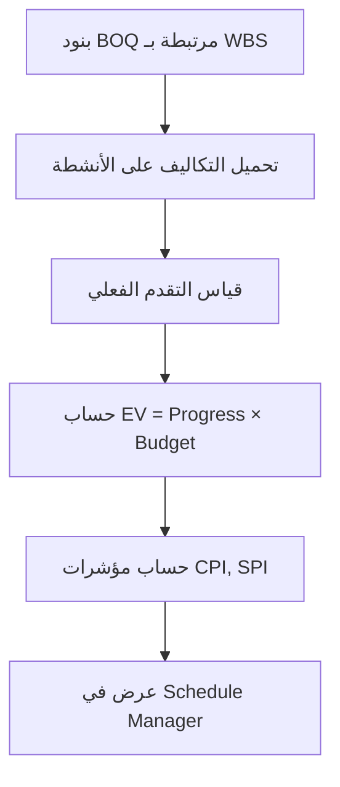

# 🔗 دليل تنفيذ تكامل التكلفة والجدول الزمني (TCI)
**Time-Cost Integration Implementation Guide**

## 📋 نظرة عامة | Overview

تم تنفيذ نظام تكامل التكلفة والجدول الزمني (Time-Cost Integration - TCI) في منصة AN.AI لإدارة المشاريع الإنشائية. يتيح هذا النظام ربط بيانات المقايسات (BOQ) بالجدول الزمني عبر هيكل تجزئة العمل (WBS)، مما يمكن من حساب مؤشرات القيمة المكتسبة (EVM) وتقييم أداء المشروع بدقة.

**تاريخ التنفيذ**: 2025-11-12  
**الإصدار**: 1.0.0  
**الحالة**: ✅ جاهز للاختبار

---

## 🎯 الأهداف الرئيسية | Main Objectives

1. **ربط المقايسات بالجدول الزمني**: تمكين الربط المباشر بين بنود المقايسة (BOQ) وأنشطة الجدول الزمني عبر WBS
2. **حساب القيمة المكتسبة (EVM)**: توفير مؤشرات أداء دقيقة (CPI, SPI, CV, SV) للمشروع
3. **إدارة التكاليف**: تحميل تكاليف المقايسة على الأنشطة المجدولة
4. **تحليل الأداء**: توفير رؤى فورية لحالة المشروع من حيث التكلفة والجدول الزمني

---

## 🏗️ البنية المعمارية | Architecture

### 1. الأنواع الجديدة | New Types

تم إضافة الأنواع التالية في `/home/user/webapp/types.ts`:

```typescript
// WBS Node for TCI Integration
export interface WBSNode {
    id: string;
    name: string;
    nameEn?: string;
    level: number;
    parentId: string | null;
    linkedBOQItems: string[];
    linkedScheduleTaskIds: number[];
    totalBudget: number;
    allocatedBudget: number;
    description?: string;
    category?: string;
}

// Extended BOQ Item
export interface BOQItemExtended extends FinancialItem {
    code: string;
    category?: string;
    wbsId?: string | null;
    description: string;
    cost: number;
}

// Extended Schedule Task with EVM
export interface ScheduleTaskExtended extends ScheduleTask {
    wbsId?: string | null;
    budgetedCost?: number;
    actualCost?: number;
    earnedValue?: number;
    costVariance?: number;
    scheduleVariance?: number;
    cpi?: number;
    spi?: number;
}

// EVM Summary
export interface EVMSummary {
    projectId: string;
    asOfDate: string;
    bac: number;   // Budget at Completion
    pv: number;    // Planned Value
    ev: number;    // Earned Value
    ac: number;    // Actual Cost
    cv: number;    // Cost Variance
    sv: number;    // Schedule Variance
    cpi: number;   // Cost Performance Index
    spi: number;   // Schedule Performance Index
    eac: number;   // Estimate at Completion
    etc: number;   // Estimate to Complete
    vac: number;   // Variance at Completion
    tcpi: number;  // To-Complete Performance Index
    percentComplete: number;
}
```

### 2. المكونات الجديدة | New Components

#### أ. BOQToWBSMapper
**المسار**: `/home/user/webapp/components/BOQToWBSMapper.tsx`

**الوظيفة**: واجهة تفاعلية لربط بنود المقايسة بعناصر WBS

**المميزات**:
- ✅ عرض شجري لهيكل WBS
- ✅ قائمة بنود المقايسة المرتبطة وغير المرتبطة
- ✅ بحث وتصفية البنود
- ✅ إحصائيات فورية (نسبة الربط، الميزانيات)
- ✅ واجهة سهلة الاستخدام بتقنية السحب والإفلات المحاكاة

**الاستخدام**:
```typescript
<BOQToWBSMapper 
    boqItems={boqItems}
    wbsStructure={wbsStructure}
    onUpdateBOQItems={(updatedItems) => {
        // Handle BOQ items update
    }}
    onUpdateWBS={(updatedWBS) => {
        // Handle WBS structure update
    }}
/>
```

#### ب. ScheduleManager (محدث)
**المسار**: `/home/user/webapp/components/ScheduleManager.tsx`

**التحديثات**:
- ✅ عرض التكاليف المحملة من BOQ
- ✅ حساب مؤشرات EVM تلقائياً
- ✅ لوحة إحصائيات EVM شاملة
- ✅ جدول مفصل بالأنشطة مع مؤشرات الأداء

**مؤشرات EVM المعروضة**:
- **PV** (Planned Value): القيمة المخططة
- **EV** (Earned Value): القيمة المكتسبة
- **AC** (Actual Cost): التكلفة الفعلية
- **CPI** (Cost Performance Index): مؤشر أداء التكلفة
- **SPI** (Schedule Performance Index): مؤشر أداء الجدول
- **CV** (Cost Variance): انحراف التكلفة
- **SV** (Schedule Variance): انحراف الجدول

### 3. التكامل مع التطبيق | App Integration

#### أ. التوجيه (Routing)
تمت إضافة مسار جديد في `App.tsx`:

```typescript
case 'tci-mapper':
    // Initialize default WBS structure
    const defaultWBS = [
        { id: 'wbs-1', name: 'أعمال الأساسات والهيكل', level: 1, parentId: null, ... },
        { id: 'wbs-1-1', name: 'أعمال الحفر', level: 2, parentId: 'wbs-1', ... },
        // ... more WBS nodes
    ];
    
    // Convert financials to BOQ format
    const boqItems = activeProject.data.financials.map(item => ({
        ...item,
        code: item.id,
        description: item.item,
        cost: item.total,
        category: /* auto-detect category */
    }));
    
    return <BOQToWBSMapper 
        boqItems={boqItems}
        wbsStructure={defaultWBS}
        onUpdateBOQItems={...}
        onUpdateWBS={...}
    />;
```

#### ب. القائمة الجانبية (Sidebar)
تمت إضافة عنصر قائمة جديد:

```typescript
<NavItem 
    icon={Link} 
    label="🔗 ربط المقايسات بالجدول (TCI)" 
    viewName="tci-mapper" 
    activeView={activeView} 
    onSelect={handleSelectView} 
    isCollapsed={isDesktopCollapsed} 
    indent 
/>
```

---

## 📊 هيكل WBS الافتراضي | Default WBS Structure

تم إنشاء هيكل WBS افتراضي من مستويين:

```
📦 wbs-1: أعمال الأساسات والهيكل
  ├── 📦 wbs-1-1: أعمال الحفر
  └── 📦 wbs-1-2: أعمال الخرسانة المسلحة

📦 wbs-2: الأعمال الكهروميكانيكية
  ├── 📦 wbs-2-1: أعمال الكهرباء
  ├── 📦 wbs-2-2: أعمال السباكة
  └── 📦 wbs-2-3: أعمال التكييف

📦 wbs-3: أعمال التشطيبات
```

---

## 🔄 سير العمل | Workflow

### 1. ربط المقايسات بـ WBS



### 2. حساب EVM



---

## 💡 معادلات EVM المستخدمة | EVM Formulas

### المؤشرات الأساسية

1. **القيمة المكتسبة (Earned Value)**
   ```
   EV = Progress% × Budgeted Cost
   ```

2. **انحراف التكلفة (Cost Variance)**
   ```
   CV = EV - AC
   CV > 0 → تحت الميزانية ✅
   CV < 0 → متجاوز للميزانية ❌
   ```

3. **انحراف الجدول (Schedule Variance)**
   ```
   SV = EV - PV
   SV > 0 → متقدم على الجدول ✅
   SV < 0 → متأخر عن الجدول ❌
   ```

4. **مؤشر أداء التكلفة (Cost Performance Index)**
   ```
   CPI = EV / AC
   CPI > 1.0 → أداء ممتاز ✅
   CPI = 1.0 → أداء حسب الخطة 
   CPI < 1.0 → أداء سيئ ❌
   ```

5. **مؤشر أداء الجدول (Schedule Performance Index)**
   ```
   SPI = EV / PV
   SPI > 1.0 → متقدم على الجدول ✅
   SPI = 1.0 → حسب الجدول
   SPI < 1.0 → متأخر عن الجدول ❌
   ```

### المؤشرات المتقدمة

6. **التكلفة المتوقعة عند الإنجاز (Estimate at Completion)**
   ```
   EAC = BAC / CPI
   ```

7. **التكلفة المتبقية المتوقعة (Estimate to Complete)**
   ```
   ETC = EAC - AC
   ```

8. **الانحراف عند الإنجاز (Variance at Completion)**
   ```
   VAC = BAC - EAC
   ```

---

## 🧪 الاختبار | Testing

### 1. البيانات التجريبية

التطبيق يحتوي على بيانات تجريبية في `mockData.ts`:

- **عدد بنود المقايسة**: 7 بنود
- **إجمالي الميزانية**: ~248,250 ر.س
- **التصنيفات**: أعمال الحفر، الخرسانة، الكهرباء، السباكة، التكييف، التشطيبات

### 2. سيناريوهات الاختبار

#### السيناريو 1: ربط بند واحد
```
1. افتح شاشة TCI Mapper
2. اختر "أعمال الحفر" من WBS
3. ربط بند "أعمال الحفر للأساسات"
4. تحقق من تحديث الميزانية
```

#### السيناريو 2: ربط عدة بنود
```
1. اختر "أعمال الكهرباء" من WBS
2. ربط جميع بنود الكهرباء (2 بنود)
3. تحقق من حساب إجمالي الميزانية
```

#### السيناريو 3: إلغاء الربط
```
1. اختر بند مرتبط
2. اضغط على "إلغاء الربط"
3. تحقق من تحديث الإحصائيات
```

### 3. التحقق من EVM

```typescript
// مثال: التحقق من حساب EV
const task = {
    budgetedCost: 100000,
    progress: 0.75
};

const expectedEV = 100000 * 0.75; // 75000
console.assert(task.earnedValue === expectedEV);
```

---

## 🚀 التشغيل | Running the Application

### 1. بدء خادم التطوير

```bash
cd /home/user/webapp
npm run dev
```

### 2. الوصول إلى التطبيق

**الرابط المحلي**: http://localhost:5173

**الرابط العام**: https://5173-i8ngr18dc7uqtnynq0d23-b9b802c4.sandbox.novita.ai

### 3. الوصول إلى TCI Mapper

1. افتح التطبيق
2. اختر مشروعاً من القائمة
3. انتقل إلى: **المقايسات والجدول الزمني** → **🔗 ربط المقايسات بالجدول (TCI)**

---

## 📈 الإحصائيات والتقارير | Statistics & Reports

### لوحة الإحصائيات في TCI Mapper

| المؤشر | الوصف |
|--------|-------|
| إجمالي البنود | عدد بنود المقايسة الكلي |
| البنود المرتبطة | عدد البنود المرتبطة بـ WBS |
| البنود غير المرتبطة | عدد البنود التي تحتاج للربط |
| نسبة الربط | النسبة المئوية للبنود المرتبطة |

### لوحة EVM في Schedule Manager

| المؤشر | الوصف | التفسير |
|--------|--------|----------|
| PV | القيمة المخططة | ما كان يجب إنجازه حتى الآن |
| EV | القيمة المكتسبة | ما تم إنجازه فعلياً (بالتكلفة) |
| AC | التكلفة الفعلية | ما تم إنفاقه فعلياً |
| CPI | مؤشر أداء التكلفة | كفاءة استخدام الميزانية |
| SPI | مؤشر أداء الجدول | كفاءة الالتزام بالجدول |
| CV | انحراف التكلفة | الفرق بين المكتسب والمنفق |
| SV | انحراف الجدول | الفرق بين المكتسب والمخطط |

---

## 🎨 واجهة المستخدم | User Interface

### الألوان المستخدمة

- **الأزرق**: القيم المخططة (PV)
- **الأخضر**: القيم المكتسبة (EV) والأداء الإيجابي
- **الأحمر**: التكاليف الفعلية (AC) والأداء السلبي
- **البنفسجي**: نسب الأداء والإحصائيات
- **الإنديجو**: العناصر المحددة والأزرار الرئيسية

### الأيقونات

- 🔗 `<Link>`: الربط والتكامل
- 💰 `<DollarSign>`: التكاليف والميزانيات
- 📊 `<TrendingUp>`: الأداء والمؤشرات
- ✅ `<CheckCircle>`: البنود المرتبطة والأداء الجيد
- ❌ `<XCircle>`: البنود غير المرتبطة والأداء السيئ
- ⚠️ `<AlertTriangle>`: التحذيرات والانحرافات

---

## 🔮 التطويرات المستقبلية | Future Enhancements

### المرحلة 1: تحسينات قصيرة المدى

- [ ] **إضافة WBS Manager**: واجهة لإنشاء وتعديل هيكل WBS بصرياً
- [ ] **توزيع التكلفة الذكي**: خوارزميات لتوزيع ميزانية WBS على الأنشطة تلقائياً
- [ ] **حفظ التكوين**: حفظ روابط WBS في قاعدة البيانات
- [ ] **تصدير التقارير**: تصدير تقارير EVM بصيغ PDF وExcel

### المرحلة 2: تحسينات متوسطة المدى

- [ ] **تحليل What-If**: محاكاة تأثير التغييرات على الجدول والتكلفة
- [ ] **تنبيهات تلقائية**: إشعارات عند تجاوز حدود CPI وSPI
- [ ] **رسوم بيانية S-Curve**: منحنيات للقيمة المخططة والمكتسبة
- [ ] **تكامل Primavera**: استيراد/تصدير بيانات من/إلى Primavera P6

### المرحلة 3: تحسينات طويلة المدى

- [ ] **تعلم آلي للتنبؤ**: التنبؤ بتاريخ الإنجاز والتكلفة النهائية
- [ ] **تكامل مع ERP**: ربط التكاليف الفعلية من أنظمة ERP
- [ ] **تحليل المخاطر**: دمج تحليل المخاطر مع TCI
- [ ] **تطبيق موبايل**: تطبيق للهواتف الذكية لتحديث التقدم ميدانياً

---

## 📝 الملاحظات الفنية | Technical Notes

### 1. إدارة الحالة (State Management)

حالياً، يتم إدارة حالة WBS محلياً في `App.tsx`. للإنتاج، يوصى بـ:

```typescript
// إضافة wbsStructure إلى ProjectData
export interface ProjectData {
    // ... existing fields
    wbsStructure?: WBSNode[];
    tciConfig?: TCIConfig;
}
```

### 2. تحسين الأداء

- استخدام `useMemo` لتقليل إعادة الحسابات
- كسل التحميل (Lazy Loading) للمكونات الكبيرة
- تحسين عمليات البحث والتصفية

### 3. التوافقية

- متوافق مع الوضع الداكن (Dark Mode)
- تصميم متجاوب (Responsive Design)
- دعم اللغة العربية بالكامل (RTL)

---

## 🐛 المشاكل المعروفة | Known Issues

1. **التكاليف الفعلية (AC)**: حالياً يتم محاكاتها بـ 10% زيادة عن EV. يجب ربطها بالفواتير الفعلية.
2. **القيمة المخططة (PV)**: حالياً يتم حسابها كـ 80% من الميزانية. يجب حسابها بناءً على تاريخ الحالة (As-Of Date).
3. **حفظ البيانات**: روابط WBS لا يتم حفظها بعد إعادة تحميل الصفحة. يحتاج لتكامل مع localStorage أو backend.

---

## 📞 الدعم والمساعدة | Support

### الموارد

- **الوثائق الفنية**: [types.ts](../types.ts)
- **كود المكونات**: [components/BOQToWBSMapper.tsx](../components/BOQToWBSMapper.tsx)
- **التطبيق الرئيسي**: [App.tsx](../App.tsx)

### الاتصال

للأسئلة أو الدعم الفني، يرجى التواصل مع فريق التطوير.

---

## 📄 الترخيص | License

هذا المشروع محمي بحقوق الطبع والنشر © 2025 AN.AI Construction Management Platform

---

**تم التنفيذ بواسطة**: GenSpark AI Developer  
**التاريخ**: 2025-11-12  
**الإصدار**: 1.0.0  

🎉 **مبروك! تم تنفيذ TCI بنجاح!** 🎉
